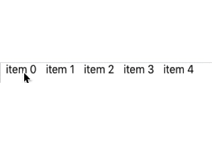
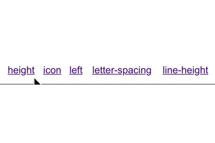

# 场景：菜单hover后导致字会发生偏移
### 做了个header菜单，效果是hover上去字体加粗，但是出了一些看起来有点奇怪的bug，每个tab会随着前边的tab的加粗产生漂移，效果类似于：

### 代码如下：
```
html:
<ul className="nav">
    <li class="first"><a href="#">item 0</a></li>
    <li><a href="#">item 1</a></li>
    <li><a href="#">item 2</a></li>
    <li><a href="#">item 3</a></li>
    <li><a href="#">item 4</a></li>
</ul>
css:
.nav li a:link,
.nav li a:visited {
    text-decoration: none;
    color: #000;
    margin-left: 8px;
    margin-right: 5px;
}
.nav li a:hover {
    text-decoration: none;
    font-weight: bold;
}
.nav li.first {
    border: none;
}
```

### 真正在页面上的每个tab的长度都是不固定的，发现这个问题的时候没有特别好的办法，只能暂时把每个tab都按照字数的长短固定一下。
### google了一下解决方案，发现了一个很有意思的解决方案，先看看效果:


### 解决的css中，发现了几行关键代码：
```
.nav a::before {
    display: block;
    content: attr(title);
    font-weight: bold;
    height: 0;
    visibility: hidden;
}
```
### 其中
```
content: attr(title);
```
### 没看明白什么意思，查了[MDN](https://developer.mozilla.org/zh-CN/docs/Web/CSS/attr)文档，有这么两句话:
* CSS表达式 attr() 用来获取选择到的元素的某一HTML属性值，并用于其样式。它也可以用于伪元素，属性值采用伪元素所依附的元素。
* attr() 表达式可以用于任何CSS属性
### 但是也没法有关于title的解释
### 尝试了一下只写:
```
.nav a::before {
    display: block;
    content: attr(title);
}
```
### 效果如下：
.png)
### 原文中的每个内容都被复制了一份，所以这个代码意思应该就是把css所在的内容复制一遍。
### 接下来的几行也很容理解了，就是先设置height为0，将两行重合在一起，再加粗来占位，最后再设置visibility为不可见。