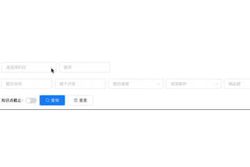

#### 今天有一条需求把我恶心到了：
```
课程管理中心-试卷管理、刷题管理-题库习题管理-精品卷、道远教师-试卷管理、轻伴读-教研管理-试卷管理、清北班管理-教研管理-班级任务管理-试卷管理

上述的5个试卷管理中的导入试卷弹窗中，添加知识点筛选
```
#### 因为要在上述很多模块中使用，所以很自然就想到了封装一个组件来实现，但是看了原本的代码后只能重构了。
#### 这是原来的代码
```
html部分：
<el-select
    v-model="search.label_ids"
    placeholder="请选择知识点标签科目"
    clearable
    @change="handleSubjectChange"
>
    <el-option
    v-for="(item) in subjectList"
    :key="item.id"
    :label="item.name"
    :value="item.id"
    />
</el-select>
<el-select
    v-show="labels[0].length"
    v-model="selectLabelIndex[0]"
    :disabled="!labels[0].length"
    placeholder="一级标签"
    multiple
    filterable
    clearable
    @change="changeLabel($event, 0)"
>
    <el-option
    v-for="(item, index) in labels[0]"
    :key="item.id"
    :label="item.name"
    :value="item.id + ',' + index"
    />
</el-select>
<el-select
    v-show="labels[1].length"
    v-model="selectLabelIndex[1]"
    :disabled="!labels[1].length"
    placeholder="二级标签"
    multiple
    filterable
    clearable
    @change="changeLabel($event, 1)"
>
    <el-option
    v-for="(item, index) in labels[1]"
    :key="item.id"
    :label="item.name"
    :value="item.id + ',' + index"
    />
</el-select>
<el-select
    v-show="labels[2].length"
    v-model="selectLabelIndex[2]"
    :disabled="!labels[2].length"
    placeholder="三级标签"
    multiple
    filterable
    clearable
    @change="changeLabel($event, 2)"
>
    <el-option
    v-for="(item, index) in labels[2]"
    :key="item.id"
    :label="item.name"
    :value="item.id + ',' + index"
    />
</el-select>
<el-select
    v-show="labels[3].length"
    v-model="selectLabelIndex[3]"
    :disabled="!labels[3].length"
    placeholder="四级标签"
    multiple
    filterable
    clearable
    @change="changeLabel($event, 3)"
>
    <el-option
    v-for="(item, index) in labels[3]"
    :key="item.id"
    :label="item.name"
    :value="item.id + ',' + index"
    />
</el-select>
js部分：
labels: {
    0: [],
    1: [],
    2: [],
    3: []
},
selectLabelIndex: {
    0: '',
    1: '',
    2: '',
    3: ''
},
search: {
    labels: [],
    // 选择的科目标签列表
    label_ids: '',
},
handleSubjectChange(subject) {
    this.selectLabelIndex = {
        0: '',
        1: '',
        2: '',
        3: ''
    }
    this.labels = {
        0: [],
        1: [],
        2: [],
        3: []
    }
    this.search.labels = []
    // this.search.label_ids = this.search.label_ids.slice(-1)
    if (this.search.label_ids) {
        this.getLabels()
    }
    else {
        this.search.labels = []
        for (let i = 0; i < 4; i++) {
            this.labels[i] = []
            this.selectLabelIndex[i] = ''
        }
    }
},
changeLabel(selected, index) {
    this.search.labels = selected.map(item => +item.split(',')[0])
        // 下级的标签都置空
        let temp = index
        while (++temp < 4) {
        this.labels[temp] = []
        this.selectLabelIndex[temp] = ''
    }
    if (selected.length === 1) {
        const nextIndex = +selected[0].split(',')[1]
        this.labels[index + 1] = this.labels[index][nextIndex].children_labels
    }
    if (selected.length === 0 && index > 0) {
        this.search.labels = this.selectLabelIndex[index - 1][0].split(',')[0]
    }
},
```

#### 上述代码的缺点就不说了，有可能是需求迭代的原因导致代码逻辑模糊不清，本着可持续发展的原则，认真读过需求后，决定重构
#### 经过n久时间的奋斗，终于有了成效，这是重构后的代码：

```
html部分：
<el-select
    v-model="selectedTopLabel"
    class="app-filter-item"
    placeholder="选择知识点标签"
    clearable
    @change="handleTopLabelChange"
>
    <el-option
    v-for="item in topLabels"
    :key="item.id"
    :label="item.name"
    :value="item.id"
    />
</el-select>

<el-select
    v-for="(label, labelIndex) in labels"
    v-show="label.length"
    :key="labelIndex"
    v-model="selectedLabels[labelIndex]"
    class="app-filter-item"
    :placeholder="`${+labelIndex + 1}级标签`"
    :multiple="isMulti"
    filterable
    clearable
    @change="changeLabel($event, labelIndex)"
>
    <el-option
    v-for="item in labels[labelIndex]"
    :key="item.id"
    :label="item.name"
    :value="item.id"
    />
</el-select>
js部分：
topLabels: [],
selectedTopLabel: '',
labels: [],
selectedLabels: []
changeLabel(data, index) {
    if (data) {
        this.labels[index + 1] = this.labels[index].find(
        label => label.id === data
        ).children_labels
    } else {
        this.labels.length = this.selectedLabels.length = index + 1
    }
},
handleTopLabelChange(data) {
    this.labels = []
    this.selectedLabels = []
    if (!data) return
    request({
        url: `/daoyuan/api/p_labels/level_label/${data}`
    }).then(res => {
        this.labels.push(res)
    })
}
```
#### 重构完成，
* 不仅代码量减少了一半以上，连逻辑也比较清晰了些，
* 功能上也进行了优化，原来代码只能扩展的四级标签，新代码理论上可以无限级标签扩展了。

# 看看效果，还不错！


#### 为什么不用级联菜单？因为产品就喜欢这样！